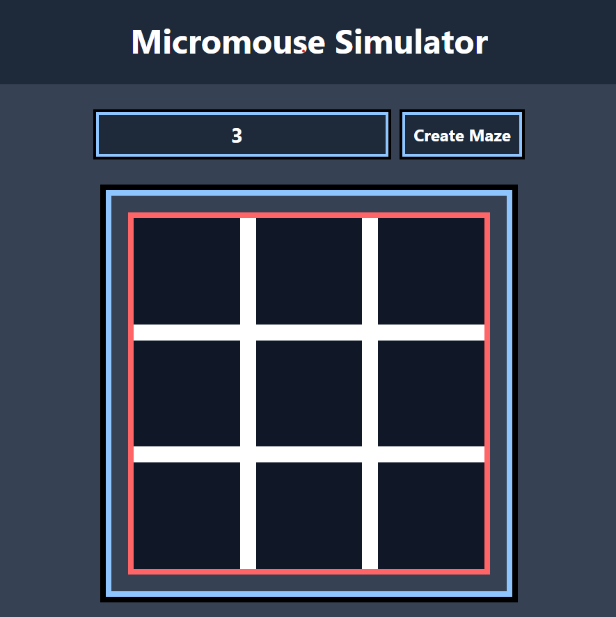

# Micromouse-sim
Micromouse simulator with react and tailwindcss

# Maze Generation
DFS Algorithm (Recursive Backtracking)

https://github.com/user-attachments/assets/afa98e13-6c16-4082-b015-2b7c028151e9

# Grid-Generator
Generation of 3x3 grid

Generation of 5x5 grid

